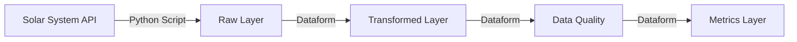
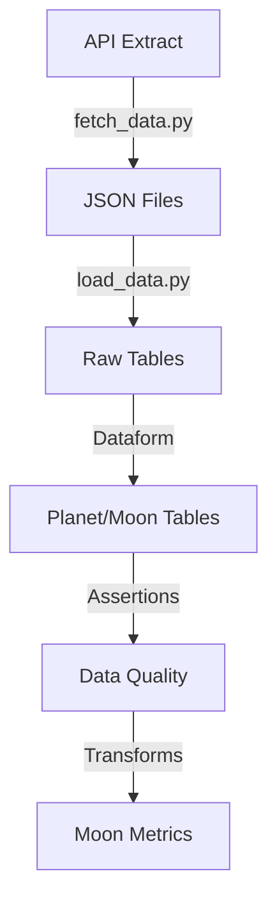

# Solar System Data Pipeline Documentation

## Overview
This document outlines the end-to-end data pipeline that extracts, loads, and transforms data from the Solar System OpenData API into BigQuery for analytics and reporting purposes. The pipeline provides detailed information about celestial bodies in our solar system, making it accessible for business intelligence and scientific analysis.

### Development Workflow
The pipeline operates across two environments:
- Development (`solar-system-dev`): Used for testing and development
- Production (`solar-system-prod`): Hosts the production data pipeline

Changes follow a structured development process:
1. Development and testing occur in `solar-system-dev`
2. Changes are proposed via GitHub Pull Requests
3. Upon PR approval, changes are merged to production
4. Dataform executes daily refreshes in the production environment

## Architecture


## Project Structure
```
solar-system-prod (BigQuery)
├── Staging
│   ├── RawPlanet
│   └── RawMoon
├── SolarSystemBody
│   ├── Planet
│   └── Moon
└── DataQuality
    ├── PlanetValidation
    └── MoonValidation

definitions (Dataform)
├── staging
│   ├── raw_planet.sqlx
│   └── raw_moon.sqlx
├── solar_system_body
│   ├── planet.sqlx
│   └── moon.sqlx
└── data_quality
    ├── planet_assertions.sqlx
    └── moon_assertions.sqlx
```

## Infrastructure

### Authentication & Security
- Uses Service Account JSON key authentication
- Required GitHub Secrets:
  - `GCP_PROJECT_ID`: Project identifier
  - `GCP_SERVICE_ACCOUNT`: Service account JSON key

### GitHub Actions Workflow
```yaml
name: Solar System Data Pipeline
on:
  workflow_dispatch:  # Allows manual triggering
  schedule:
    # Runs at 8am Central Time (13:00 UTC)
    - cron: '0 13 * * *'
jobs:
  extract-and-load:
    runs-on: ubuntu-latest
    permissions:
      contents: 'read'
    steps:
      - name: Checkout repository
        uses: actions/checkout@v4

      - name: Set up Python
        uses: actions/setup-python@v5
        with:
          python-version: '3.9'

      - name: Authenticate using service account key
        uses: google-github-actions/auth@v2
        with:
          credentials_json: ${{ secrets.GCP_SERVICE_ACCOUNT }}

      - name: Set up Cloud SDK
        uses: google-github-actions/setup-gcloud@v2
        with:
          project_id: ${{ secrets.GCP_PROJECT_ID }}
          export_default_credentials: true

      - name: Install dependencies
        run: |
          python -m pip install --upgrade pip
          pip install requests google-cloud-bigquery

      - name: Extract data from API
        id: extract
        run: |
          python fetch_data.py
          if [ ! -f raw_planets.json ] || [ ! -f raw_moons.json ]; then
            echo "Error: Data extraction failed - JSON files not created"
            exit 1
          fi

      - name: Load data to BigQuery
        id: load
        if: steps.extract.outcome == 'success'
        run: |
          python load_data.py

      - name: Clean up temporary files
        if: always()
        run: |
          rm -f raw_planets.json raw_moons.json
```

### Environment Management
- **Development Environment**
  - Project: `solar-system-dev`
  - Used for pipeline development and testing
  - Mirrors production structure
  - Changes validated through PR process

- **Production Environment**
  - Project: `solar-system-prod`
  - Hosts production data pipeline
  - Daily Dataform refresh schedule
  - Protected by PR approval process

- **Deployment Flow**
  1. Changes developed and tested in dev environment
  2. Pull Request created for code review
  3. Upon approval, merged to main branch
  4. Dataform applies changes to production

### Dataform Scheduling
- Daily refresh schedule configured in Dataform
- Runs after GitHub Actions pipeline completes
- Executes in order:
  1. Data transformations (Planet and Moon tables)
  2. Data quality assertions
  3. Metrics calculations

## Data Collection

### Data Source
- **Source**: Le Système Solaire OpenData API
- **Endpoint**: https://api.le-systeme-solaire.net/rest/bodies/
- **Update Frequency**: Daily
- **Data Format**: JSON

### Data Extraction (fetch_data.py)
```python
import requests
import json

# Define the base API URL
url = "https://api.le-systeme-solaire.net/rest/bodies/"

# Make a request to fetch all bodies
try:
    response = requests.get(url)
    
    if response.status_code == 200:
        all_bodies = response.json()['bodies']
        
        # Separate lists for planets and moons
        planets = []
        moons = []
        
        # Loop through each body and categorize as planet or moon
        for body in all_bodies:
            if body.get('isPlanet'):
                planets.append(body)
            elif body.get('aroundPlanet') is not None:
                moons.append(body)
        
        # Save planets data to JSON file
        with open('raw_planets.json', 'w') as planets_file:
            json.dump(planets, planets_file, indent=4)
        
        # Save moons data to JSON file
        with open('raw_moons.json', 'w') as moons_file:
            json.dump(moons, moons_file, indent=4)

        print("Data extraction complete. Check 'raw_planets.json' and 'raw_moons.json' files.")

    else:
        print(f"Failed to fetch data. Status code: {response.status_code}, {response.text}")

except requests.exceptions.RequestException as e:
    print(f"Error fetching data: {e}")
```

### BigQuery Load Process (load_data.py)
```python
from google.cloud import bigquery
import os
import json

# Initialize BigQuery client
client = bigquery.Client()

# Define your BigQuery dataset and table names
dataset_id = 'solar-system-prod.Staging'
planets_table_id = f'{dataset_id}.RawPlanet'
moons_table_id = f'{dataset_id}.RawMoon'

# Load planets data
with open('raw_planets.json', 'r') as file:
    planets_data = json.load(file)

# Load moons data
with open('raw_moons.json', 'r') as file:
    moons_data = json.load(file)

# Define job config with automatic schema detection
job_config = bigquery.LoadJobConfig(
    source_format=bigquery.SourceFormat.NEWLINE_DELIMITED_JSON,
    autodetect=True
)

# Load planets data into BigQuery
planets_job = client.load_table_from_json(planets_data, planets_table_id, job_config=job_config)
planets_job.result()  # Wait for the job to complete

# Load moons data into BigQuery
moons_job = client.load_table_from_json(moons_data, moons_table_id, job_config=job_config)
moons_job.result()  # Wait for the job to complete

print(f"Loaded data into {planets_table_id} and {moons_table_id}.")
```

### Raw Layer Tables
**Dataset**: `solar-system-prod.Staging`

#### RawPlanet
- Contains raw planet data from API
- Schema auto-detected from JSON
- Refreshed daily via Python ETL
- Contains nested JSON structures for mass, volume
- French naming conventions for some fields

#### RawMoon
- Contains raw moon data from API
- Schema auto-detected from JSON
- Refreshed daily via Python ETL
- Contains nested JSON structures
- Includes reference to parent planet in French naming

## Data Processing

### Transformed Layer
**Dataset**: `solar-system-prod.SolarSystemBody`

#### Planet Table Transformation (Planet.sqlx)
```sql
config {
  type: "table",
  tags: ["SolarSystemBody"],
  schema: "SolarSystemBody", 
  description: "This table stores descriptive dimensional data about planets in the solar system",
  uniqueKey: ["PlanetId"],
  assertions: {
    uniqueKey: true,
    nonNull: ["PlanetId", "PlanetName"]
  }
}

select
  -- Use perihelion value for each planet in window func to generate a unique PlanetId
  row_number() over (order by perihelion) as PlanetId
  , englishName as PlanetName
  , gravity as Gravity
  , mass.MassValue as Mass
  , vol.volValue as Volume
  , density as Density
  , avgTemp as AverageSurfaceTemperature
  , axialTilt as AxialTilt
  , eccentricity as Eccentricity
  , perihelion as Perihelion 
  , aphelion as Aphelion
from ${ref("RawPlanet")}
```

#### Moon Table Transformation (Moon.sqlx)
```sql
config {
  type: "table",
  tags: ["SolarSystemBody"],
  schema: "SolarSystemBody", 
  description: "This table stores descriptive dimensional data about planetary satellites (moons) in the solar system",
  uniqueKey: ["MoonId"],
  assertions: {
    uniqueKey: true,
    nonNull: ["MoonId", "MoonName", "PlanetId"]
  }
}

with PreparePlanetId as 
(
  select
    englishName as MoonName
    , aroundPlanet.planet as OrbitingBody
    -- Assign PlanetId for moons that orbit solar system planets
    -- The data come are sourced from a French API, so spellings are slightly different
    , case
        when aroundPlanet.Planet = 'terre'
          then 3
        when aroundPlanet.Planet = 'mars'
          then 4
        when aroundPlanet.Planet = 'jupiter'
          then 5
        when aroundPlanet.Planet = 'saturne'
          then 6
        when aroundPlanet.Planet = 'uranus'
          then 7
        when aroundPlanet.Planet = 'neptune'
          then 8
      else null 
    end as PlanetId
    , gravity as Gravity
    , mass.MassValue as Mass
    , vol.volValue as Volume
    , density as Density
    , avgTemp as AverageSurfaceTemperature
    , axialTilt as AxialTilt
    , eccentricity as Eccentricity
    , perihelion as Perihelion 
    , aphelion as Aphelion
  from ${ref("RawMoon")}
)

, PrepareMoonId as 
(
  select
    -- Use PlanetId as base for MoonId and then increment by this partition
    -- For satellites of non-planetary bodies like Pluto or Makemake, group these via a pseudo PlanetId 9 for now
    concat(coalesce(PlanetId,9),row_number() over (partition by PlanetId order by MoonName)) as MoonId
    , MoonName
    , OrbitingBody
    , PlanetId
    , Gravity
    , Mass
    , Volume
    , Density
    , AverageSurfaceTemperature
    , AxialTilt
    , Eccentricity
    , Perihelion 
    , Aphelion
  from PreparePlanetId
)

select
  -- Standardizing MoonId to be 3 digits as no bodies have more than 999 moons and converting to int
  case
    when length(MoonId) = 2
      then cast(concat(substr(MoonId,1,1), '00', substr(MoonId,2)) as int64)
    when length(MoonId) = 3
      then cast(concat(substr(MoonId,1,1), '0', substr(MoonId,2)) as int64)
    else cast(MoonId as int64)
  end as MoonId
  , MoonName
  , initcap(OrbitingBody) as OrbitingBody
  , PlanetId
  , Gravity
  , Mass
  , Volume
  , Density
  , AverageSurfaceTemperature
  , AxialTilt
  , Eccentricity
  , Perihelion 
  , Aphelion
from PrepareMoonId
```

### Field Definitions

#### Planet Table
| Field Name | Description | Data Type | Source Field | Transformation |
|------------|-------------|-----------|--------------|----------------|
| PlanetId | Unique identifier | INTEGER | N/A | Generated using ROW_NUMBER() based on perihelion distance |
| PlanetName | English name | STRING | englishName | Direct mapping |
| Gravity | Surface gravity | FLOAT64 | gravity | Direct mapping |
| Mass | Planet mass | FLOAT64 | mass.massValue | Nested field extraction |
| Volume | Planet volume | FLOAT64 | vol.volValue | Nested field extraction |
| Density | Planet density | FLOAT64 | density | Direct mapping |
| AverageSurfaceTemperature | Mean surface temperature | FLOAT64 | avgTemp | Direct mapping |
| AxialTilt | Axial tilt angle | FLOAT64 | axialTilt | Direct mapping |
| Eccentricity | Orbital eccentricity | FLOAT64 | eccentricity | Direct mapping |
| Perihelion | Closest approach to Sun | FLOAT64 | perihelion | Direct mapping |
| Aphelion | Farthest distance from Sun | FLOAT64 | aphelion | Direct mapping |

#### Moon Table
| Field Name | Description | Data Type | Source Field | Transformation |
|------------|-------------|-----------|--------------|----------------|
| MoonId | Unique identifier | INTEGER | N/A | Generated using PlanetId and sequence |
| MoonName | English name | STRING | englishName | Direct mapping |
| OrbitingBody | Parent planet name | STRING | aroundPlanet.planet | Capitalized French name |
| PlanetId | Parent planet ID | INTEGER | N/A | Mapped from French planet names |
| Gravity | Surface gravity | FLOAT64 | gravity | Direct mapping |
| Mass | Moon mass | FLOAT64 | mass.massValue | Nested field extraction |
| Volume | Moon volume | FLOAT64 | vol.volValue | Nested field extraction |
| Density | Moon density | FLOAT64 | density | Direct mapping |
| AverageSurfaceTemperature | Mean surface temperature | FLOAT64 | avgTemp | Direct mapping |
| AxialTilt | Axial tilt angle | FLOAT64 | axialTilt | Direct mapping |
| Eccentricity | Orbital eccentricity | FLOAT64 | eccentricity | Direct mapping |
| Perihelion | Closest approach to parent | FLOAT64 | perihelion | Direct mapping |
| Aphelion | Farthest from parent | FLOAT64 | aphelion | Direct mapping |

## Data Quality

### Data Quality Assertions
**Dataset**: `solar-system-prod.DataQuality`

#### Planet Data Quality (planet_assertions.sqlx)
```sql
config {
  type: "assertion",
  tags: ["DataQuality"],
  schema: "DataQuality",
  description: "Data quality checks for Planet table"
}

with PlanetValidation as
(
  select 
    PlanetId
    , PlanetName
    , Gravity
    , Mass
    , Volume
    , Density
    , AverageSurfaceTemperature
    , AxialTilt
    , Eccentricity
    , Perihelion 
    , Aphelion
    , case 
      when Mass <= 0 then 'Invalid Mass'
      when Volume <= 0 then 'Invalid Volume'
      when Density <= 0 then 'Invalid Density'
      when Gravity <= 0 then 'Invalid Gravity'
      when AverageSurfaceTemperature < 0 then 'Invalid Temperature (below absolute zero)'
      when Perihelion >= Aphelion then 'Invalid Orbit (perihelion >= aphelion)'
      when Eccentricity < 0 or Eccentricity >= 1 then 'Invalid Eccentricity'
      when PlanetName is null then 'Missing PlanetName'
    end as ValidationError
  from ${ref("Planet")}
)

select 
  PlanetId
  , PlanetName
  , Gravity
  , Mass
  , Volume
  , Density
  , AverageSurfaceTemperature
  , AxialTilt
  , Eccentricity
  , Perihelion 
  , Aphelion
  , ValidationError
from PlanetValidation
where ValidationError is not null 
```

#### Moon Data Quality (moon_assertions.sqlx)
```sql
config {
  type: "assertion",
  tags: ["DataQuality"],
  schema: "DataQuality",
  description: "Data quality checks for Moon table"
}

with MoonValidation as
(
  select 
    MoonId
    , MoonName
    , OrbitingBody
    , Gravity
    , Mass
    , Volume
    , Density
    , AverageSurfaceTemperature
    , AxialTilt
    , Eccentricity
    , Perihelion 
    , Aphelion
    , case 
      when Mass <= 0 then 'Invalid Mass'
      when Volume <= 0 then 'Invalid Volume'
      when Density <= 0 then 'Invalid Density'
      when Gravity <= 0 then 'Invalid Gravity'
      when AverageSurfaceTemperature < 0 then 'Invalid Temperature (below absolute zero)'
      when Perihelion >= Aphelion then 'Invalid Orbit (perihelion >= aphelion)'
      when Eccentricity < 0 or Eccentricity >= 1 then 'Invalid Eccentricity'
      when OrbitingBody is null then 'Missing orbital body'
      when MoonName is null then 'Missing MoonName'
    end as ValidationError
  from ${ref("Moon")}
)

select 
  MoonId
  , MoonName
  , OrbitingBody
  , Gravity
  , Mass
  , Volume
  , Density
  , AverageSurfaceTemperature
  , AxialTilt
  , Eccentricity
  , Perihelion 
  , Aphelion
  , ValidationError
from MoonValidation
where ValidationError is not null 
```

### Data Quality Checks
Both Planet and Moon tables are validated for:

1. Physical Property Validations:
   - Mass must be positive
   - Volume must be positive
   - Density must be positive
   - Gravity must be positive
   - Temperature must be above absolute zero

2. Orbital Parameter Validations:
   - Perihelion must be less than Aphelion
   - Eccentricity must be between 0 and 1

3. Required Field Validations:
   - Planet: PlanetName must not be null
   - Moon: MoonName and OrbitingBody must not be null

4. Relationship Validations:
   - Built-in uniqueness checks for PlanetId and MoonId
   - Non-null constraints on key fields

### Data Quality Handling
- Assertions run as part of the Dataform pipeline
- Failed assertions stop the pipeline
- Validation errors are logged in the DataQuality dataset
- Regular monitoring of validation results recommended
- Assertions tested in dev environment before production deployment

## Analytics Layer

### Moon Metrics Table (moon_metrics.sqlx)
```sql
config {
  type: "table",
  tags: ["SolarSystemBody"],
  schema: "SolarSystemBody",
  description: "Statistical analysis of planetary systems including moon counts, physical characteristics, and orbital metrics aggregated by planet",
  columns: {
    PlanetId: "Unique identifier for the planet being analyzed",
    PlanetName: "English name of the planet",
    TotalMoonCount: "Total number of known moons orbiting this planet",
    MoonsWithMass: "Number of moons orbiting this planet that have known mass measurements",
    MoonsWithDensity: "Number of moons orbiting this planet that have known density measurements",
    MoonsWithGravity: "Number of moons orbiting this planet that have known gravity measurements",
    AvgMoonMass: "Average mass of all moons with known mass measurements for this planet in kilograms (kg)",
    SmallestMoonMass: "Mass of the smallest moon with a known mass measurement for this planet in kilograms (kg)",
    LargestMoonMass: "Mass of the largest moon with a known mass measurement for this planet in kilograms (kg)",
    AvgMoonDensity: "Average density of all moons with known density measurements for this planet in grams per cubic centimeter (g/cm³)",
    AvgMoonGravity: "Average surface gravity of all moons with known gravity measurements for this planet in meters per second squared (m/s²)",
    LargeMoons: "Number of moons with mass greater than twice the average moon mass in the solar system",
    MediumMoons: "Number of moons with mass between the average and twice the average moon mass in the solar system",
    SmallMoons: "Number of moons with mass less than the average moon mass in the solar system",
    MoonsWithValidOrbit: "Number of moons with valid eccentricity measurements between 0 and 1",
    AvgOrbitalEccentricity: "Average orbital eccentricity of all moons with valid measurements for this planet",
    MoonsWithPerihelion: "Number of moons with known perihelion measurements",
    AvgPerihelion: "Average perihelion distance of all moons with known measurements for this planet in kilometers (km)",
    MoonsWithAphelion: "Number of moons with known aphelion measurements",
    AvgAphelion: "Average aphelion distance of all moons with known measurements for this planet in kilometers (km)"
  }
}

with Moons as 
(
  select
    MoonId
    , MoonName
    , OrbitingBody
    , PlanetId
    , Gravity
    , Mass
    , Volume
    , Density
    , AverageSurfaceTemperature
    , AxialTilt
    , Eccentricity
    , Perihelion 
    , Aphelion
  from ${ref("Moon")}
  where PlanetId is not null 
)

, MoonsByPlanet as
(
  select 
    PlanetId
    , count(MoonId) as TotalMoonCount
    , count(case when Mass > 0 then 1 end) as MoonsWithMass
    , avg(case when Mass > 0 then Mass end) as AvgMoonMass
    , count(case when Density > 0 then 1 end) as MoonsWithDensity
    , avg(case when Density > 0 then Density end) as AvgMoonDensity
    , min(case when Mass > 0 then Mass end) as SmallestMoonMass
    , max(case when Mass > 0 then Mass end) as LargestMoonMass
    , count(case when Gravity > 0 then 1 end) as MoonsWithGravity
    , avg(case when Gravity > 0 then Gravity end) as AvgMoonGravity
  from Moons
  group by 1
)

, MoonSizeCategories as
(
  select 
    *
    , case 
        when Mass > (select avg(Mass) * 2 from Moons) then 'Large'
        when Mass > (select avg(Mass) from Moons) then 'Medium'
        else 'Small'
      end as SizeCategory
  from Moons
  where Mass > 0  -- Only categorize moons with valid mass
)

, OrbitCharacteristics as
(
  select
    PlanetId
    , count(case when Eccentricity between 0 and 1 then 1 end) as MoonsWithValidOrbit
    , avg(case when Eccentricity between 0 and 1 then Eccentricity end) as AvgOrbitalEccentricity
    , count(case when Perihelion > 0 then 1 end) as MoonsWithPerihelion
    , avg(case when Perihelion > 0 then Perihelion end) as AvgPerihelion
    , count(case when Aphelion > 0 then 1 end) as MoonsWithAphelion
    , avg(case when Aphelion > 0 then Aphelion end) as AvgAphelion
  from Moons m
  group by 1
)

select 
  mbp.PlanetId 
  , p.PlanetName
  -- Moon counts
  , mbp.TotalMoonCount
  , mbp.MoonsWithMass
  , mbp.MoonsWithDensity
  , mbp.MoonsWithGravity
  
  -- Mass metrics (for moons with valid mass)
  , mbp.AvgMoonMass
  , mbp.SmallestMoonMass
  , mbp.LargestMoonMass
  
  -- Physical characteristics (only valid values)
  , mbp.AvgMoonDensity
  , mbp.AvgMoonGravity
  
  -- Size distribution (only for moons with valid mass)
  , count(case when msc.SizeCategory = 'Large' then 1 end) as LargeMoons
  , count(case when msc.SizeCategory = 'Medium' then 1 end) as MediumMoons
  , count(case when msc.SizeCategory = 'Small' then 1 end) as SmallMoons
  
  -- Orbital characteristics (only valid values)
  , oc.MoonsWithValidOrbit
  , oc.AvgOrbitalEccentricity
  , oc.MoonsWithPerihelion
  , oc.AvgPerihelion
  , oc.MoonsWithAphelion
  , oc.AvgAphelion
from MoonsByPlanet mbp
left join ${ref("Planet")} p 
  on p.PlanetId = mbp.PlanetId
left join MoonSizeCategories msc
  on mbp.PlanetId = msc.PlanetId
left join OrbitCharacteristics oc
  on mbp.PlanetId = oc.PlanetId
group by 1,2,3,4,5,6,7,8,9,10,11,15,16,17,18,19,20
order by PlanetId 
```

### Key Features of MoonMetrics
1. Data Completeness Tracking
   - Counts of moons with valid measurements for each metric
   - Removal of sparse metrics (Volume, Temperature) to focus on well-populated data
   - Clear distinction between total moons and moons with valid measurements

2. Physical Characteristics
   - Mass distribution analysis
   - Density and gravity metrics where available
   - Size categorization based on mass comparisons

3. Orbital Analysis
   - Eccentricity statistics
   - Orbital distance measurements (perihelion/aphelion)
   - Validation of orbital parameters

4. Statistical Aggregations
   - Averages calculated only from valid values
   - Min/Max calculations for mass metrics
   - Distribution analysis through size categories

### Potential Visualizations (WIP)
1. Moon Distribution Charts
   - Bar chart of total moons per planet
   - Stacked bars showing size categories
   - Data completeness comparison

2. Physical Properties Visualizations
   - Mass distribution plots
   - Gravity comparisons
   - Density analysis

3. Orbital Characteristics
   - Eccentricity distribution
   - Orbital distance comparisons
   - Relationship between size and orbit

4. Data Quality Dashboards
   - Measurement availability by planet
   - Data completeness tracking
   - Historical data trends

### Development Process
- Metrics changes are first tested in dev environment
- Performance impact assessed before production deployment
- Historical comparisons validated across environments
- Parallel testing available for major changes

## Summary

### Pipeline Overview
The Solar System Data Pipeline implements a complete ETL process:
1. Extracts data from Le Système Solaire OpenData API
2. Loads raw data into BigQuery staging tables
3. Transforms data into standardized Planet and Moon tables
4. Validates data quality through assertions
5. Generates analytical metrics for visualization

### Key Components
- **Data Collection**: Python scripts for API interaction and BigQuery loading
- **Infrastructure**: GitHub Actions for orchestration, Dataform for transformations
- **Data Quality**: Automated assertions for physical and logical validation
- **Analytics**: Comprehensive moon metrics aggregated by planet

### Scheduling
1. GitHub Actions Pipeline
   - Runs daily at 8am Central Time
   - Handles API extraction and raw data loading
   - Automated error handling and cleanup

2. Dataform Jobs
   - Daily scheduled refresh
   - Sequential execution of transformations
   - Data quality validations
   - Metrics calculation

### Data Flow


### Best Practices Implemented
1. Data Quality
   - Null handling
   - Physical property validation
   - Relationship integrity
   - Measurement validation

2. Code Organization
   - Modular structure
   - Clear naming conventions
   - Comprehensive documentation
   - Version control

3. Performance
   - Efficient transformations
   - Appropriate table partitioning
   - Optimized metric calculations

### Environment Management Best Practices
1. Development
   - All changes start in dev environment
   - Full testing required before PR creation
   - Data validation across environments
   - Performance testing in dev first

2. Production
   - Protected by PR approval process
   - Daily scheduled refreshes
   - Monitoring and alerting
   - Regular backup and recovery testing

3. Deployment Process
   - Feature branch --> PR --> Dev testing --> PR Review --> Production
   - Dataform schedule management
   - Environment-specific configurations
   - Validation of successful deployments

### Future Enhancements
1. Data Improvements
   - Additional data quality checks
   - Historical tracking of changes
   - Incremental processing
   - Additional metric calculations

2. Visualization
   - Interactive dashboards
   - Trend analysis
   - Comparative visualizations
   - Data quality monitoring

3. Infrastructure
   - Advanced error notification
   - Performance monitoring
   - Backup and recovery procedures
   - Enhanced scheduling options

4. Analytics
   - Additional derived metrics
   - Predictive analytics
   - Cross-body comparisons
   - Temporal analysis

### Maintenance Considerations
1. Regular Monitoring
   - API availability
   - Data quality metrics
   - Pipeline performance
   - Resource utilization

2. Updates Required
   - API endpoint changes
   - Schema modifications
   - Documentation updates
   - Dependency management

3. Security
   - Credential rotation
   - Access control reviews
   - Security patch management
   - Audit logging

### Support and Contact
For questions or issues:
1. Check GitHub repository documentation
2. Review Dataform job logs
3. Monitor BigQuery audit logs
4. Consult API documentation

This pipeline provides a robust foundation for solar system data analysis, with room for expansion and enhancement based on future requirements and use cases.

